Lancaster Social Housing
================
óglaðr kjarr
19 August 2018

Introduction
============

This document takes data on historic social housing lets within Lancaster and Morecambe areas, and does some EDA to get a feel for the data. The data was taken from the letting [website](https://www.idealchoicehomes.co.uk/Data/ASPPages/1/56.aspx), harvested using Python in [this](https://github.com/ogladr-kjarr/one-day-eda/lancaster-social-housing/Harvest_Lancaster_Housing_Association_Lettings.ipynb) notebook.

Looking at the data below we can see the columns and types of data being dealt with. There is the:

-   main housing area
-   band which dictates the person's housing need
-   effective date, the date a person submitted or last updated their application
-   number of bids on the property
-   type of property
-   floor the home is located on
-   number of bedrooms
-   internal ref number
-   cycle start is the start of the window the let was advertised in
-   cycle end is the end of the window the let was advertised in.

<!-- -->

    ## # A tibble: 5 x 11
    ##   area  band  date   bids type  floor bedrooms sheltered   ref cycle_start
    ##   <chr> <chr> <chr> <int> <chr> <chr>    <int> <chr>     <int> <chr>      
    ## 1 Trum… Band… 25/0…    21 Flat  Grou…        2 No          901 22/08/2012 
    ## 2 Ryel… Band… 27/0…    16 House              3 No          902 22/08/2012 
    ## 3 Bran… Band… 09/0…    17 Flat  1st …        2 No          903 22/08/2012 
    ## 4 Hala  Band… 09/0…    15 Flat  Grou…        2 No          904 22/08/2012 
    ## 5 West… Band… 29/0…    81 Flat  1st …        1 No          905 22/08/2012 
    ## # ... with 1 more variable: cycle_end <chr>

Data Tidying
============

The steps taken to tidy the data include the:

-   removal of areas that are not within Lancaster or Morecambe (this is my subjective view of area boundaries - Galgate is Lancaster for my purposes)
-   removal of entries that have no band or let date
-   removal of sheltered housing entries
-   removal of the following collumns: 'floor', 'sheltered', 'ref', 'cycle start' and 'cycle end'
-   removal of entries whose let period were in the years before 2012
-   removal of entries with a bedroom number greater than six
-   conversion of cycle\_end to a datetime column then used in place of the date column
-   extraction of year and month from datetime
-   creation of ordered factors for year and area to aid in plotting

EDA
===

For all analysis, the cycle end date is used to give the timestamp of the letting, and entries matching the criteria in the `data tidying` section have been removed.

First there's a few general sections looking at the average number of lets, and the average ratio of bids per let, by a single variable. Second is a section looking at only two bands, C and D, with single bedroom lets, for the years 2017 and 2018. Third is a look at the delay between application/application update and time to winning a let.

**I think the data has been harvested, filtered, and plotted correctly, but there may be mistakes and plots may be misleading.**

Housing Areas
-------------

Looking at the housing areas, we can see that over the years there has been variation within each area as to the number of lets. The current year, 2018, looks to be smaller in most areas when compared to other years, even taking into account the lack of data for the remaining four months of this year.

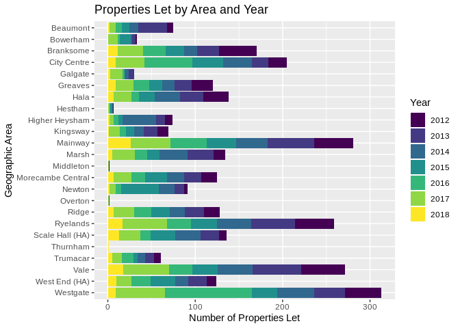

If we compare only 2017 lets to 2018 the difference is more obvious.

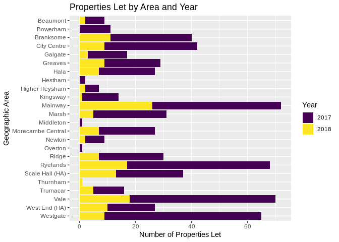

On the above theme of 2018 appearing to have fewer lets than previous years, if we look at the timeseries of lets aggregated to the month level we can see there is not much of a pattern. I thought potentially a large amount of lets may become availabe towards the end of previous years to explain the 2018 behaviour shown in previous plots but this is not the case.

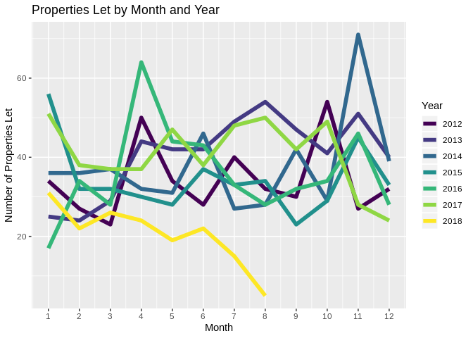

Another point of interest with 2017/2018 data is to look at the ratio of bids to lets. While the ratios are mostly higher in 2018, they're not as different as expected when the reduced number of properties to bid on is taken into account. The most salient point appears to be that a lot of people wanted to live in Newton this year.

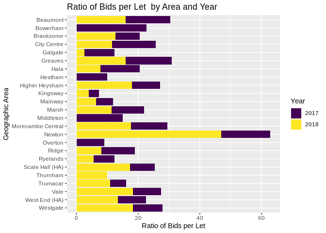

Housing Bands
-------------

Looking at the bands we see the difference in lets over the years in an easier form to digest.

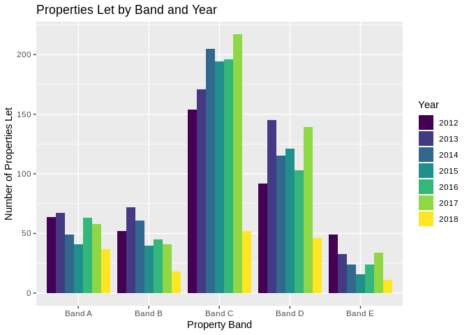

Looking at the ratios of bids per let, we can see C and D bid ratios increasing as well as A, but B and E are less.

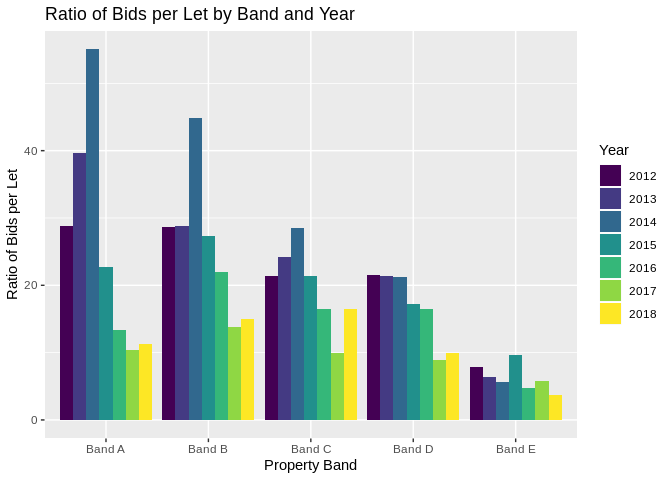

Number of Bedrooms
------------------

Looking to the number of lets by bedroom shows that there has been a similar amount of one bedroom and two bedroom lets. This suprised me as I had assumed two bedroom properties is the default for most builds, and so would be the largest by far.

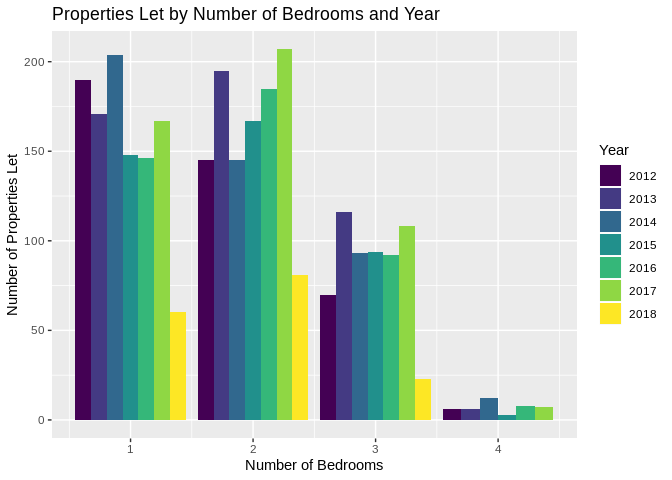

The ratio of bids to lets by bedroom shows that the demand for single bedroom properties is the higest, descending as the number of rooms increases.

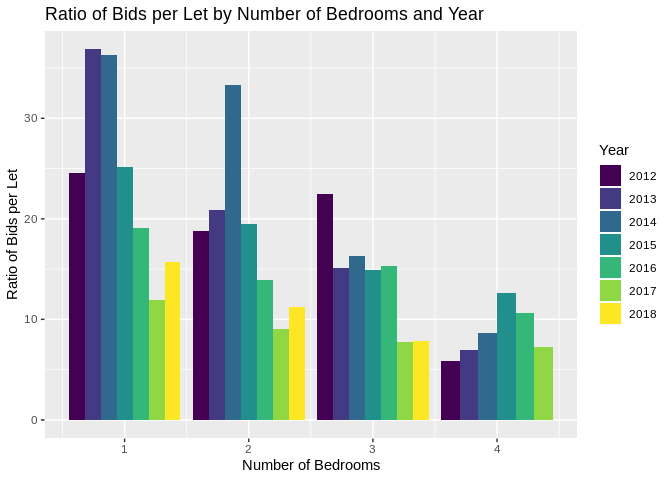

Recent One-Bedroom, Band B, C, & D Lets
---------------------------------------

I'm not happy with having different breaks on the x-axis for the number of lets and bid ratio between the two plots, but the facet\_grid command needs the free\_x axis so that the two different types of data can have their own axis. When I get time I'll see if I can dictate two different sets of breaks for each facet.

### Band B

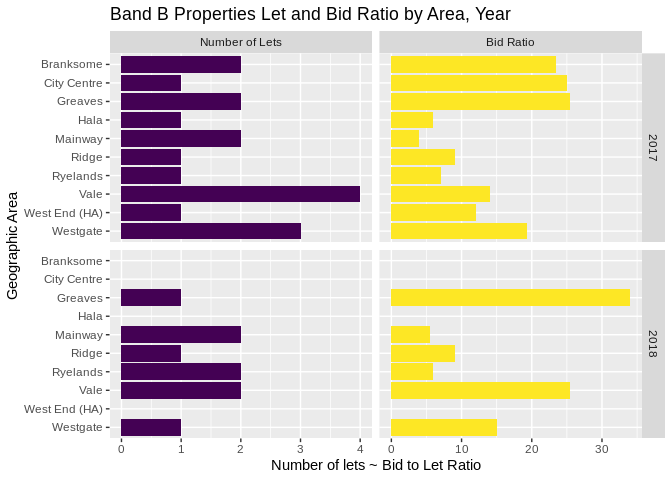

### Band C

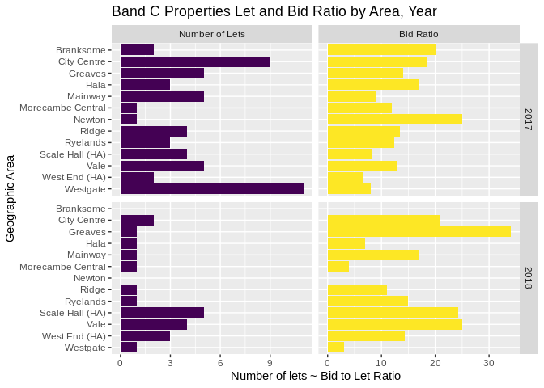

### Band D

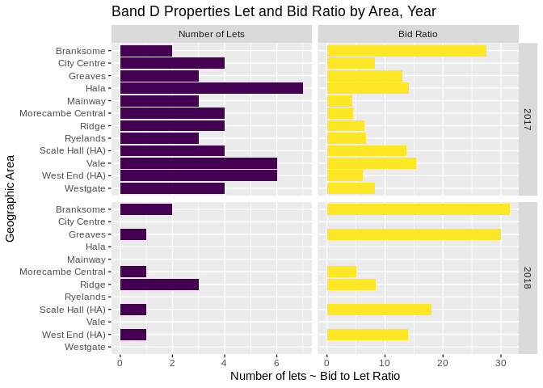

Effective Date
--------------

The effective date represents the time that a housing application was made, or last updated. It's a little frustrating that it is overloaded with two meanings, however it lets us have a look at the spread/delay in application/update to getting a property if we assume for this purpose that it is when an application is first made to join the housing register.

Plotting the average delay between an application being made, and a bid being won, grouped by the year the bid was won, we see a similar trend over all years, with band A having the least amount of time to wait, and band D having the longest, with bands B and C generally falling linearly between.

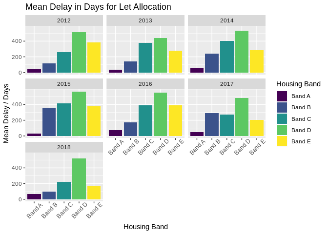

In the plot above what isn't captured is how variable the delays are, and so lastly I want to use some boxplots to look at the same data, but this time for only band B, C, and D properties, with one bedroom. The first uses all the data, while the second removes data with delay greater than 1000 days.

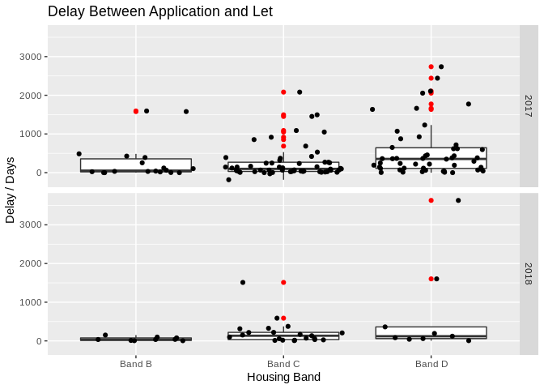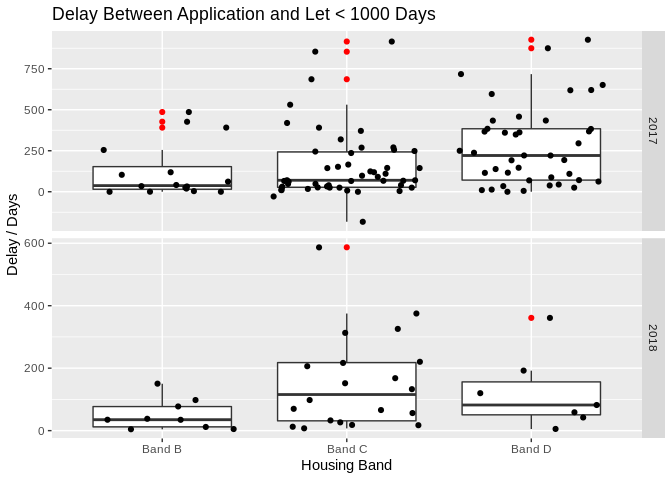
